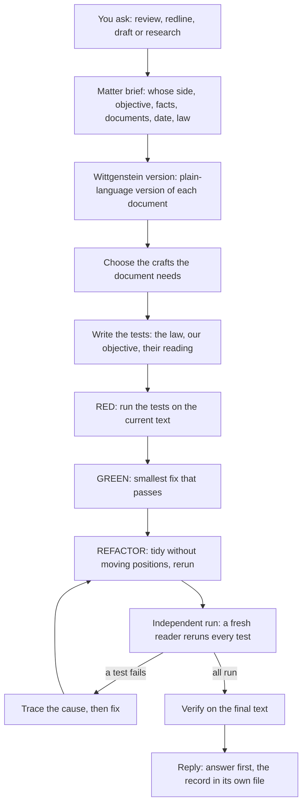

# Legal Superpowers

**Legal Superpowers makes an AI agent do legal work the careful way.** Before it drafts, reviews, redlines or researches anything, it writes down the tests the work must pass. Then it checks the document against those tests, fixes what fails, and has a fresh reader check everything again before it tells you the work is done.

It is a package of 12 **skills**: plain-text instruction files that an AI agent reads and follows. It works in Claude Code, Codex, pi and other agents that support skills.

> [!NOTE]
> This guide assumes you know nothing about AI agents or skills. If you already do, jump to [Install](#6-install) or [The 12 skills](#5-the-12-skills).

## Contents

1. [The one-minute version](#1-the-one-minute-version)
2. [Words you need first](#2-words-you-need-first)
3. [Why "tests" for legal work?](#3-why-tests-for-legal-work)
4. [What happens when you ask for something](#4-what-happens-when-you-ask-for-something)
5. [The 12 skills](#5-the-12-skills)
6. [Install](#6-install)
7. [Your first matter](#7-your-first-matter)
8. [What it will never do](#8-what-it-will-never-do)
9. [Time and cost](#9-time-and-cost)
10. [What is in this folder](#10-what-is-in-this-folder)
11. [Testing the package](#11-testing-the-package)
12. [Changing a skill](#12-changing-a-skill)
13. [Questions people ask](#13-questions-people-ask)
14. [Credits and licence](#14-credits-and-licence)

---

## 1. The one-minute version

You give an AI agent a contract and a job: "We act for the buyer. Review this and redline it." With this package installed, the agent:

1. **Asks whose side it is on and what you want,** if you have not said.
2. **Writes a plain-language version** of the document, so everyone agrees what it says.
3. **Writes tests:** short "what if" questions with the answer the document must give your client.
4. **Runs the tests on the current text** and shows which ones fail.
5. **Fixes the failing text** with the smallest change that passes.
6. **Has a fresh reader, who did not write the fixes, rerun every test** as the other side would read the document.
7. **Tells you the answer first,** in plain words, and keeps the full record in a separate file.

---

## 2. Words you need first

These words appear everywhere in the package. Each one has one meaning.

<details>
<summary><b>AI agent, harness, model</b></summary>

- An **AI model** is the engine that writes text (for example Claude, or GPT).
- An **AI agent** is a model that can also use tools: read files, write files, run commands, search the web.
- A **harness** is the program that runs the agent on your computer: Claude Code, Codex and pi are harnesses. The same skills can run in different harnesses, with different models.

</details>

<details>
<summary><b>Skill, SKILL.md, description</b></summary>

- A **skill** is a folder with a file called `SKILL.md` inside. The file is instructions in plain English.
- At the top of each `SKILL.md` is a **description** that starts "Use when…". The agent reads every description, and when your request matches one, it opens that skill and follows it.
- You do not have to name a skill. Saying "redline this for the buyer" is enough for the right skills to start.

</details>

<details>
<summary><b>Subagent</b></summary>

A **subagent** is a second agent that the main agent starts for one job, with a fresh memory. The package uses subagents for specialists (a tax expert, a data-protection expert) and for the independent reader who rechecks the work. A fresh memory matters: a reader who did not write the text is not tempted to grade its own work.

</details>

<details>
<summary><b>Matter, matter brief</b></summary>

- A **matter** is one piece of legal work: one review, one redline, one research question.
- The **matter brief** is a short form filled in before any work starts: whose side we are on, what the client wants, the facts, the documents, the relevant date, and what is known about the governing law. No tests are written until the brief exists.

</details>

<details>
<summary><b>Test (test card), test table</b></summary>

A **test** is a short "what if" question with the answer the document must give. Each test is written as a **test card** with these fields:

| Field | Meaning |
|---|---|
| Source | Whose test it is: **the law**, **our objective**, or **their reading** (see below) |
| Rule or objective | What must hold |
| Scenario | The facts or event that trigger it |
| Expected result | The outcome the text must produce |
| Evidence | The document text, instruction, fact or verified authority behind it |
| Failure consequence | What goes wrong if it fails |
| Result | Pass, Fail, Partial or Blocked, with the text or authority behind it |

All the cards together make the **test table**, one row per card. The test table is the matter's only record: problems found are simply the failing rows. There is no separate issues list.

</details>

<details>
<summary><b>The three sources of tests</b></summary>

Every test comes from one of three places:

- **The law:** is the text valid, enforceable and compliant?
- **Our objective:** does the client get the outcome it needs?
- **Their reading:** does it survive the most hostile reading the other side, or a court, could give it?

</details>

<details>
<summary><b>RED, GREEN, REFACTOR</b></summary>

These three words come from software testing.

- **RED:** run the tests on the current text and show which fail, quoting the text.
- **GREEN:** write the smallest complete change that makes the failing tests pass.
- **REFACTOR:** tidy up (definitions, cross-references, numbering) without moving anyone's position, then rerun the tests the tidy-up touched.

</details>

<details>
<summary><b>Pass, Fail, Partial, Blocked, open Pass</b></summary>

- **Pass:** the text gives the right answer.
- **Fail:** the text gives the wrong answer, or no answer (for example, a word it relies on is never defined, or a schedule it points to is missing).
- **Partial:** part of it works and a named gap remains.
- **Blocked:** drafting alone cannot settle it: the law behind it is not yet verified, a fact is unconfirmed, or the client has to decide something.
- **Open Pass:** a Pass that only the drafter has checked so far. It becomes a final Pass only when the independent reader agrees.

</details>

<details>
<summary><b>Craft</b></summary>

A **craft** is a specialist field a document needs: tax, data protection, finance, intellectual property, employment, and so on. The package does not use a fixed list. It reads the document and decides which crafts it needs, even 20 or more, and gives each one the decisions in its field.

</details>

<details>
<summary><b>Wittgenstein version</b></summary>

A short, plain-language version of a legal document that keeps its core in focus: the deal, who must do what and by when, the money, what happens if someone does not perform, how it ends, and what each side really gets. It is named after the philosopher Ludwig Wittgenstein, who argued that a word's meaning is found in how it is used. The package clarifies the document's key words by looking at how the document itself uses them. Every piece of work comes with one.

</details>

<details>
<summary><b>Verdict, record, clock, settled edit</b></summary>

- The **verdict** answers "is it ready?": **Yes** (every test passed on the independent run), **Not yet** (every test passed, but the independent run has not finished), or **No** (something failed or is blocked).
- The **record** is the brief plus the test table, kept in its own file.
- A **clock** is a deadline that can run out while the work is going on: a notice window, a renewal cutoff, a limitation period.
- A **settled edit** is a change where you give the exact words ("change 30 days to 60 days"). It skips the questions and the specialists, but is still checked.

</details>

---

## 3. Why "tests" for legal work?

Lawyers already test arguments: an argument has to "stand the test" of a law. This package makes the tests explicit and writes them *before* the work.

Here is a real example from the package's own sample agreement (`tests/legal-superpowers/fixtures/generic-service-agreement.md`):

- **Test:** The provider delivers the report 10 days late. Can the client end the contract immediately? The client needs the answer to be yes.
- **Current text:** Section 6 lets the client terminate if the provider "misses a material deadline". But the agreement sets no delivery deadline at all (the services are in Exhibit A, which is not attached), and it never says which deadlines are material.
- **Result: Fail.** The test cannot even be run until "deadline" is pinned down.
- **Fix:** set the deadlines and state which are material. **Pass.** Then rerun every other test, because a fix in one place can break another.

Without the test written first, a reviewer might read "misses a material deadline", think "fine, the client can terminate", and move on.

---

## 4. What happens when you ask for something



**What you see in the reply,** in this order:

1. **The answer to your question,** in plain words, first. Then the verdict, what it rests on (faults in the text, or documents we do not have), and whether an independent reader has checked it.
2. **Any clock** that is running.
3. **What it needs from you:** each missing document, fact or decision, one line each.
4. **The work itself.** A redline starts with a list of the changes, one line each with its reason, before the full wording.
5. **Where the record and the Wittgenstein version are saved.**

> [!TIP]
> Tell it who will read the answer and how long it should be ("for our CEO, two pages", "quick one"). The reply is written for that reader. If you say you will paste or forward it, the reply is only the text for that reader, with nothing meant for you inside or after it.

---

## 5. The 12 skills

You never need to call these by name. Each one starts on its own when your request matches its description.

| Step | Skill | What it does | When it starts |
|---|---|---|---|
| Brief | `legal-matter-brief` | Records the side, objective, facts, documents, date and known law before any tests | Any new legal work |
| Clarify | `legal-wittgenstein` | Writes the plain-language version and pins down what key words mean in this document | Any work on a document; "simplify", "explain", "what does this mean" |
| Staff | `legal-craft-delegation` | Picks the specialist crafts the document needs and gives each its decisions | Work that needs more than general contract skill |
| Test-first work | `legal-test-driven-work` | Writes the tests, then runs RED, GREEN and REFACTOR | Drafting, review, redlining, argument |
| Law behind a test | `legal-authority-research` | Finds which country's or state's law applies and checks the statutes and cases from free public sources | A test that depends on the law |
| Plan | `legal-work-planning` | Turns a bigger matter into reviewed, test-linked tasks | Several clauses, documents, crafts or decisions |
| Execute | `executing-legal-work-plans` | Works through a plan task by task and stops at decisions only the client can make | Carrying out a plan |
| Trace | `legal-issue-tracing` | Finds the root cause of a failing test before anything is rewritten | A fix that did not work, or a failure nobody can explain |
| Independent run | `requesting-legal-review` | Has a fresh reader rerun the tests as the other side would read the text | Before any work is called done |
| Feedback | `receiving-legal-review` | Turns each comment into a test and checks it against the text before acting on it | Comments or a markup come back |
| Done | `legal-verification-before-completion` | Reruns every test on the final text before anyone says "done" or "ready" | Any claim that the work is finished |
| Build skills | `writing-legal-skills` | Test-driven development for the skills themselves | Adding or changing a skill |

---

## 6. Install

> [!IMPORTANT]
> This repository is private. To install it you need a GitHub account that has been given access, and you need to be signed in to GitHub on your computer.

### Claude Code

1. Open Claude Code.
2. Type `/plugin marketplace add vivekgoquest/legal-superpowers` and press Enter.
3. Type `/plugin install legal-superpowers@legal-superpowers-dev` and press Enter.
4. Start a new session. The skills are now available.

### Codex

1. Download the package: `git clone https://github.com/vivekgoquest/legal-superpowers.git ~/legal-superpowers`
2. Link each skill into Codex's skills folder:

   ```bash
   mkdir -p ~/.codex/skills
   for d in ~/legal-superpowers/skills/*/; do ln -s "$d" ~/.codex/skills/; done
   ```

3. Start a new Codex session.

### pi

1. Download the package as in Codex step 1.
2. Start pi with every skill folder loaded:

   ```bash
   args=(); for d in ~/legal-superpowers/skills/*/; do args+=(--skill "$d"); done
   pi "${args[@]}"
   ```

### Any other agent

If your agent reads skill folders (a folder with a `SKILL.md`), point it at the `skills/` folder. If it does not, you can start your request with: *"A package of legal skills is installed at `~/legal-superpowers/skills/`: one folder per skill, each with a SKILL.md. Read each skill's description and follow every skill whose description fits."*

### Check it works

Ask: *"Give me the Wittgenstein version of this agreement"* and attach any contract. If the reply is organised around "the deal", "who must do what", "the economics" and "what each side really gets", the skills are working.

---

## 7. Your first matter

**Good first requests:**

- "We act for the customer. Review this SaaS agreement and redline what they need."
- "Our client is the borrower on this loan note. Anything they should push back on before signing? Quick one."
- "Give our CEO a two-page summary of this licence. He is not a lawyer."
- "Change the notice period in clause 8 from 30 days to 60 days." (a settled edit)
- "Under the law that governs this agreement, can the landlord end it early?"

**Give it what a junior lawyer would need:**

1. **Whose side you are on.** Without it, a review is written neutrally, and for a redline it will stop and ask.
2. **Every document,** including schedules, exhibits and side letters. Anything missing is reported as missing; it is never guessed.
3. **Who will read the answer, and how long it should be.**
4. **Whether it may search the web** with details from your document. By default, web searches carry only the legal question, never your party names, amounts or wording.

**It may ask you questions first.** It asks only what changes the work, in one message, and offers a sensible default for each. Reply "go" to accept the defaults.

**Where things end up:** the reply is short. The full record (the brief and every test with its result) is saved as a file, and the reply tells you where.

---

## 8. What it will never do

These rules hold in every skill:

- **Never invent** a fact, a clause, a definition, a citation, a case, a statute or the governing law. A blank stays blank. A missing schedule is reported as missing.
- **Never assume a jurisdiction.** It works out the governing law from the document and the facts, or marks it Unknown. It assumes one only if you tell it to, and labels the assumption.
- **Never say "done" without evidence.** Every completion claim rests on a fresh run of every test on the final text.
- **Never let the writer grade its own work.** The independent run is done by a reader that did not draft the text.
- **Cite the clause** for every claim about a document, and quote the document's exact words in quotation marks.
- **Keep your confidential facts out of web searches** unless you allow it.
- **Keep uncertainty visible:** every Blocked test says what would unblock it.

**What it deliberately does not do:**

- **No disclaimers.** It does not add "this is not legal advice" or "consult a lawyer". It is built for legal professionals, and it gives direct answers.
- **No fixed list of countries or crafts.** It works out what the document needs at the time.
- **No paid databases.** Law is checked against official and free public sources, and a test is marked Blocked if the law cannot be verified that way.

---

## 9. Time and cost

Doing it properly takes more time and more model usage than a quick chat answer, because every step runs, including the independent run and often several specialists.

- In our tests, a one-page loan note took about 20 minutes and roughly 300,000 tokens in Claude Code.
- A long agreement with many specialists can take hours.
- Asking for a short answer ("quick one", "just tell me") shortens the reply, not the work.

> [!TIP]
> To save cost, use a cheaper model for simple matters, or run the package in a harness whose usage you already pay for.

---

## 10. What is in this folder

```
legal-superpowers/
├── skills/                       The 12 skills, one folder each (the actual package)
│   └── <skill-name>/SKILL.md     The instructions for one skill
├── tests/legal-superpowers/
│   ├── fixtures/                 Short sample agreements written for testing
│   ├── corpus/                   Real public agreements used for evaluation (see its README)
│   ├── <skill-name>/pressure/    Test prompts that try to make a skill fail
│   ├── test-skills.sh            Structure checks for the whole package
│   ├── test-legal-wittgenstein.sh
│   ├── test-triggering.sh        Checks each skill starts from its own description
│   └── triggers.tsv              The requests used by the trigger check
├── docs/legal-superpowers/specs/ The design documents; the goal document is the one in force
├── .claude-plugin/               Install details for Claude Code
├── .codex-plugin/                Install details for Codex
├── .cursor-plugin/               Install details for Cursor
├── scripts/bump-version.sh       Updates the version number in every install file at once
├── CLAUDE.md                     Instructions for an agent working on this repository (AGENTS.md is a link to it)
└── LICENSE                       MIT licence
```

The design in force is [`docs/legal-superpowers/specs/2026-09-24-legal-superpowers-goal-design.md`](docs/legal-superpowers/specs/2026-09-24-legal-superpowers-goal-design.md). Read it before changing any skill.

---

## 11. Testing the package

There are three kinds of test, and they are easy to confuse:

1. **Legal tests** are the product: the tests the agent writes for your matter.
2. **Work-product checks** make sure the agent cited its sources and invented nothing.
3. **Skill tests** check that the skills themselves make an agent behave, even under pressure. This section is about these.

**Structure checks** (free, a few seconds):

```bash
bash tests/legal-superpowers/test-skills.sh
bash tests/legal-superpowers/test-legal-wittgenstein.sh all
```

**Trigger check** (uses model credits): runs one short Claude Code session per line of `triggers.tsv` and checks the right skill starts on its own.

```bash
bash tests/legal-superpowers/test-triggering.sh
```

**Behaviour tests** follow `writing-legal-skills`: run each prompt in `tests/legal-superpowers/<skill>/pressure/` with and without the skill, have independent judges grade the results, then evaluate on real agreements in `tests/legal-superpowers/corpus/` by taking one side and checking the result helps that side without inventing anything.

> [!NOTE]
> Four corpus agreements have no open licence, so they are kept on the maintainer's computer only and are not in this repository. The test scripts skip them on a fresh download.

---

## 12. Changing a skill

Skills are changed the same test-first way the package works. The full method is in `skills/writing-legal-skills/SKILL.md`. In short:

1. **Write the test first:** a pressure prompt in `tests/legal-superpowers/<skill>/pressure/`, in a legal professional's words, that you expect the skill to fail.
2. **Record the failure** with the current skill (RED).
3. **Make the smallest change** to the skill that fixes it (GREEN).
4. **Rerun,** with independent judges who did not write the change, and check nothing else broke.
5. **Run the structure checks** before you commit.

**Rules for skill text:** never put real client facts, party names or corpus wording into a skill; each rule lives in one skill, and other skills point to it; each skill must start from its own "Use when" description, because the package has no other way to call it.

---

## 13. Questions people ask

<details>
<summary><b>Is this legal advice?</b></summary>

It is a tool for legal professionals. It gives direct answers and does not add disclaimers, because the professional using it is responsible for the advice. Every answer shows what it rests on, cites the clauses, and marks what is not verified.

</details>

<details>
<summary><b>Does it know the law of my country?</b></summary>

It has no built-in list. For each test that depends on the law, it works out which law applies, then finds and checks the statute or case in official and free public sources, including whether it is still current. If it cannot verify the law, the test is marked Blocked and says what is needed.

</details>

<details>
<summary><b>Will it send my contract to the internet?</b></summary>

Only the model provider your harness uses sees it, as with any AI tool. Web searches carry only the legal question, the clause type and the jurisdiction, never party names, amounts, dates or the document's wording, unless you allow it.

</details>

<details>
<summary><b>Why did it ask me questions before starting?</b></summary>

A test needs a side. "Is this indemnity good?" has a different answer for each party. It asks only what changes the work, and offers defaults you can accept with "go".

</details>

<details>
<summary><b>Where are all the tests? The reply is short.</b></summary>

In the record file. The reply gives its path. The reply is short on purpose, written for the reader you named.

</details>

<details>
<summary><b>My harness cannot start subagents. Does it still work?</b></summary>

Yes. The work still runs. The independent run is then done as a separate pass in the same session and is clearly labelled "not independent", so you know it was not checked by a fresh reader.

</details>

<details>
<summary><b>Why is it called Wittgenstein?</b></summary>

Ludwig Wittgenstein argued that you find a word's meaning by looking at how it is used, not in a dictionary. The plain-language version works that way: to explain what "material" means in your contract, it looks at every clause that uses the word and what that clause does with it.

</details>

---

## 14. Credits and licence

This repository began as a fork of Superpowers by Jesse Vincent and Prime Radiant, which applied the same test-first discipline to software. It remains under the MIT Licence in [`LICENSE`](LICENSE).
