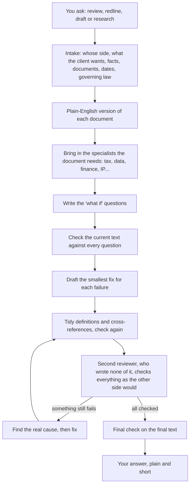

# Legal Superpowers

**Legal Superpowers makes an AI assistant review, redline, draft and research the way a careful lawyer would.** It makes the assistant ask whose side it is on, write down what the document must achieve for your client, check every clause against that list, fix what fails, and have a second reviewer check the work before it tells you anything is done.

You do not need to know anything about AI to use it. You ask in ordinary words, the way you would brief a junior colleague.

## Install: paste one message

Open your AI coding tool (Claude Code, Codex, pi or similar), paste the message below, and press Enter. The tool downloads the package, installs it and checks it. When it says it has finished, start a new session.

```text
Install the Legal Superpowers skills for me. Change nothing else on my computer.

1. Get the package. If ~/legal-superpowers already exists, run: git -C ~/legal-superpowers pull
   Otherwise run: git clone https://github.com/vivekgoquest/legal-superpowers.git ~/legal-superpowers
   If that fails for lack of access, try: gh repo clone vivekgoquest/legal-superpowers ~/legal-superpowers
   If both fail, stop and tell me I need access to the private GitHub repository and must be signed in to GitHub.
2. Work out which AI tool you are running in, and use its personal skills folder:
   Claude Code: ~/.claude/skills. Codex: ~/.codex/skills. pi: ~/.pi/agent/skills.
   Any other tool: the folder where it loads personal skills (folders that contain a SKILL.md); if it has none, use ~/.agents/skills and tell me.
3. Create that folder if it does not exist. For each folder inside ~/legal-superpowers/skills/, create a symbolic link with the same name in the skills folder, pointing to it (on Windows, copy the folder instead, replacing any earlier copy from this package). If something with that name is already there and did not come from this package, leave it alone and tell me.
4. Check the result: run bash ~/legal-superpowers/tests/legal-superpowers/test-skills.sh and confirm that all 12 skills are in the skills folder, each with a SKILL.md.
5. Tell me in plain words what you installed and where, and that I must start a new session to use it.
```

To update later, paste the same message again.

> [!NOTE]
> This guide is for lawyers and legal teams. Technical details are in [SETUP.md](SETUP.md).

## Contents

1. [What it is, in one picture](#1-what-it-is-in-one-picture)
2. [Why a checklist first?](#2-why-a-checklist-first)
3. [What happens when you ask for something](#3-what-happens-when-you-ask-for-something)
4. [What you get back](#4-what-you-get-back)
5. [How to ask](#5-how-to-ask)
6. [Safeguards: what it will never do](#6-safeguards-what-it-will-never-do)
7. [Honest limits](#7-honest-limits)
8. [Words you will see](#8-words-you-will-see)
9. [Questions lawyers ask](#9-questions-lawyers-ask)
10. [Credits](#10-credits)

---

## 1. What it is, in one picture

Think of a well-run law firm.

- **The AI assistant is a capable junior associate.** It reads fast and drafts fast, but it needs supervision, and left alone it can be overconfident.
- **Legal Superpowers is the firm's written procedures** that the associate must follow on every matter. They cover intake, how to read a document, when to bring in a specialist, what to check before drafting, and who signs off.

There are 12 procedures. The associate picks the right ones from what you ask, so you never have to name them. (In the technical world these procedures are called "skills", and the assistant is called an "agent". You will not need those words again.)

---

## 2. Why a checklist first?

A good lawyer reviewing a contract asks "what if?" questions: *what if they deliver late? what if they go insolvent? what if the price changes?* Then they check whether the contract gives the right answer.

This package makes the assistant write those "what if" questions down **before** it touches the document. Each question states the answer your client needs. In the package they are called **tests**.

**An example** (from the package's own sample agreement):

- **The question:** the provider delivers the report 10 days late. Can our client end the contract immediately? Our client needs the answer to be **yes**.
- **What the contract says:** Section 6 lets the client terminate immediately if the provider "misses a material deadline". But the contract sets no delivery date at all (the services are described in Exhibit A, which is not attached), and it never says which deadlines are "material".
- **Result: fails.** As written, the client cannot rely on that right.
- **The fix:** set the delivery dates and state which ones are material. Then check every other question again, because a fix in one place can break another.

A reviewer without the question written down might read "misses a material deadline" and move on. Writing the question first is what catches it.

Every question comes from one of three places:

| Source | The question it asks |
|---|---|
| **The law** | Is this valid, enforceable and compliant? |
| **Our objective** | Does our client get what it needs? |
| **Their reading** | Does it survive the most hostile reading the other side, or a judge, could give it? |

---

## 3. What happens when you ask for something



In words:

1. **Intake.** It fills in a short matter form: whose side we are on, what the client wants, the facts, the documents, the relevant date, and what is known about the governing law. If something important is missing, it asks you, in one message, and suggests a sensible default for each point.
2. **Plain-English version.** It writes a short, plain version of each document, so everyone agrees what the document actually says. (The package calls this the **Wittgenstein version**; see [section 8](#8-words-you-will-see).)
3. **Specialists.** It looks at the document and decides which specialists it needs. A licence with personal data gets a data-protection specialist; a cross-border payment gets a tax specialist. There is no fixed list and no limit.
4. **The "what if" questions.** Each specialist writes the questions for its area.
5. **Check, fix, tidy.** It checks the current text against every question, drafts the smallest fix for each failure, then tidies definitions and cross-references without changing anyone's position.
6. **Second reviewer.** A separate reviewer, who drafted none of it, checks every question again, reading the text as the other side would. A lawyer never marks their own homework, and neither does the assistant.
7. **Final check.** Before it says "done" or "ready", it checks everything once more on the final text.

**Two shortcuts it takes on its own:**

- **A simple instructed change** ("change 30 days to 60 days in clause 8") skips the intake questions and the specialists. It still checks every other place the change affects.
- **A bigger matter** (several documents, many clauses, decisions you must make) gets a short work plan first, which is also reviewed.

---

## 4. What you get back

Your answer comes first, in plain words, written for whoever will read it. Then, in this order:

1. **The answer to your question,** then whether the document is ready, what that rests on, and whether the second reviewer has checked it.
2. **Deadlines running now,** if any: a notice window, a renewal cutoff, a limitation period.
3. **What it needs from you:** each missing document, fact or decision, one line each.
4. **The work itself.** A redline starts with a list of the changes, one line each with its reason, then the full wording.
5. **Where the full file is saved:** every question with its result, and the plain-English version.

**An illustration** of a short reply, based on the sample agreement above (shortened):

> **Not reliably.** Northstar can end the contract immediately only if Harbor "misses a material deadline" (§6), but the contract sets no delivery date and never says which deadlines are material. Exhibit A, which describes the services, is not attached (§1). Northstar can still end the contract for any reason on 30 days' written notice (§6).
>
> **What we need from you:** Exhibit A.
>
> **Proposed change:** add the delivery date for the final report and state that it is a material deadline.
>
> **Full file:** every question and its result, and the plain-English version, saved at `…/record.md`.

> [!TIP]
> If you say you will forward or paste the reply ("I'm sending this to the client"), you get only the text for that reader, with nothing meant for you inside it.

---

## 5. How to ask

Brief it the way you would brief a junior colleague.

**Requests that work well:**

- "We act for the customer. Review this SaaS agreement and redline what they need."
- "Our client is the borrower on this loan note. Anything they should push back on before signing? Quick one."
- "Give our CEO a two-page summary of this licence. He is not a lawyer."
- "Change the notice period in clause 8 from 30 days to 60 days."
- "Under the law that governs this agreement, can the landlord end it early?"

**Always tell it:**

1. **Whose side you are on.** A review without a side is written neutrally. For a redline it will stop and ask, because a redline has to push one way.
2. **Every document:** schedules, exhibits, side letters, the term sheet. Anything missing is reported as missing, never guessed.
3. **Who will read the answer, and how long it should be.** "For the board, one page." "Quick one."
4. **Whether it may search the internet** using details from your document. If you say nothing, its searches carry only the legal question, never your client's name, the amounts or the contract's wording.

**When it asks questions,** answer the ones you can and reply "go" to accept its suggested defaults for the rest.

---

## 6. Safeguards: what it will never do

- **Never make things up.** No invented facts, clauses, cases, statutes or governing law. A blank stays blank. A missing schedule is reported as missing.
- **Never assume which country's or state's law applies.** It works that out from the document and the facts, or says it is unknown. It assumes a law only if you tell it to, and labels that assumption.
- **Never mark its own work.** A separate reviewer checks everything it drafts.
- **Never say "done" or "ready" without a final check** on the final text.
- **Always cite the clause** for every point about a document, and quote the document's exact words.
- **Always show what is uncertain:** each open point says what would settle it (a document, a fact, a decision from you, or law that could not be verified).
- **Keep your client's details out of internet searches** unless you allow it.

**What it deliberately leaves out:**

- **No "this is not legal advice" disclaimers.** It is built for legal professionals and gives direct answers. You remain responsible for the advice you give.
- **No paid research databases.** It checks law against official and free public sources, and says so when it cannot verify something that way.

---

## 7. Honest limits

- **It is slower than a chat answer.** It does every step, including the second review and often several specialists. A one-page loan note took about 20 minutes in our tests; a long agreement with many specialists can take hours. Asking for a "quick one" shortens the answer, not the checking.
- **It only knows the law it can verify** from free public sources. Where it cannot, that point is left open and marked, not guessed.
- **It is only as complete as the documents you give it.** A referenced agreement you did not supply is treated as missing, so your answer will say it depends on that document.
- **It does not replace your judgement.** It shows its reasons and sources so you can check them quickly, and it leaves client decisions to you.

---

## 8. Words you will see

<details>
<summary><b>Test</b>: a "what if" question</summary>

A short question with the answer the document must give your client, for example: "If the supplier goes insolvent, can we terminate at once? Needed answer: yes." Each test records where it comes from (the law, our objective, or their reading), the facts that trigger it, and what goes wrong if it fails.

</details>

<details>
<summary><b>Pass, Fail, Partial, Blocked</b>: the four results</summary>

- **Pass:** the document gives the right answer.
- **Fail:** it gives the wrong answer, or none (for example, a key word is never defined or a schedule is missing).
- **Partial:** part of it works, and a named gap remains.
- **Blocked:** redrafting alone cannot settle it. The law has not been verified, a fact is unconfirmed, or the client must decide something.

</details>

<details>
<summary><b>Ready: Yes, Not yet, No</b>: the verdict</summary>

- **Yes:** every test passed and the second reviewer agreed.
- **Not yet:** every test passed, but the second reviewer has not finished.
- **No:** something failed or is blocked. The reply tells you which points decide it.

</details>

<details>
<summary><b>Wittgenstein version</b>: the plain-English version</summary>

A short, plain-language version of a document built around its core: the deal, who must do what and by when, the money, what happens if someone does not perform, how it ends, and what each side really gets. It is named after the philosopher Ludwig Wittgenstein, who said a word's meaning is found in how it is used. So to explain what "material" means in your contract, it looks at every clause that uses the word and what that clause does with it, rather than reaching for a dictionary.

</details>

<details>
<summary><b>Specialist (craft)</b></summary>

A specialist area the document needs: tax, data protection, finance, intellectual property, employment and so on. The assistant decides which ones from the document itself, and each specialist owns the decisions in its field.

</details>

<details>
<summary><b>Second reviewer (independent review)</b></summary>

A separate AI reviewer that starts fresh, drafted none of the text, and checks every test as the other side would. If your setup cannot run a separate reviewer, the check is still done, but the result is labelled "not independent" so you know.

</details>

<details>
<summary><b>The record</b></summary>

The file holding the matter form and every test with its result. It is the single record of the matter: problems are simply the tests that failed. The reply is short; the record is complete.

</details>

---

## 9. Questions lawyers ask

<details>
<summary><b>Is my client's contract safe?</b></summary>

The document is seen by the AI provider your firm's tool uses, as with any AI product. Internet searches carry only the legal question, the type of clause and the jurisdiction. They never carry party names, amounts, dates or the contract's wording, unless you allow it.

</details>

<details>
<summary><b>Does it know the law of my country?</b></summary>

It has no built-in list of countries. For each question that depends on the law, it works out which law applies, finds the statute or case in official and free public sources, and checks it is still current. If it cannot verify it, it says so and leaves that point open.

</details>

<details>
<summary><b>Why did it ask me questions before starting?</b></summary>

Because the right answer depends on whose side you are on. "Is this indemnity good?" has a different answer for each party. It asks only what changes the work, and offers defaults you can accept with "go".

</details>

<details>
<summary><b>The answer is short. Where is the detail?</b></summary>

In the record file; the reply tells you where it is saved. The reply is short on purpose, written for the reader you named.

</details>

<details>
<summary><b>Can I use it for litigation or research, not only contracts?</b></summary>

Yes. For an argument, the "what if" questions are the elements of the legal rule, and the facts are what the argument is tested against. For a research question, it finds and verifies the law and gives you the answer first, with its sources.

</details>

<details>
<summary><b>Who sets it up?</b></summary>

You can: paste the message in [Install](#install-paste-one-message) into your AI tool and it installs itself. It works with Claude Code, Codex, pi and other AI coding tools. You need access to the private GitHub repository.

</details>

---

## 10. Credits

This package began as an adaptation of Superpowers by Jesse Vincent and Prime Radiant, which brought the same checklist-first discipline to software. It is released under the MIT Licence in [`LICENSE`](LICENSE).
