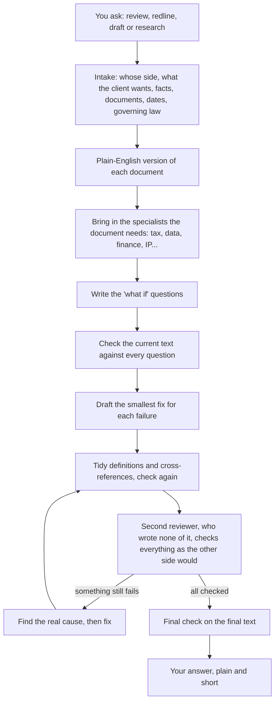

# Legal Superpowers

**Legal Superpowers makes an AI assistant do legal work the way a careful supervising lawyer would insist on.** It takes a proper brief, writes down what the document must achieve before it drafts anything, has a second reviewer check every point, and shows you exactly what each answer rests on.

AI assistants can review and draft in minutes. They can also sound certain while missing a clause, inventing a case, or approving their own work. This package keeps the speed and removes those habits.

**Four things to know:**

1. [**It writes the checklist before it touches the document.**](#1-it-writes-the-checklist-before-it-touches-the-document) Every clause is tested against "what if" questions drawn from the law, your client's objective, and the other side's reading.
2. [**It answers first, and keeps facts, gaps, proposals and your decisions apart.**](#2-it-answers-first-and-keeps-facts-gaps-proposals-and-your-decisions-apart) You see the answer, then what it rests on, what is missing, and what only you can decide.
3. [**It will not invent, assume the governing law, or mark its own work.**](#3-it-will-not-invent-assume-the-governing-law-or-mark-its-own-work) Every point cites its clause or source, and anything unverified stays visibly open.
4. [**You can use it on your computer, in claude.ai or in ChatGPT, and you brief it in plain English.**](#4-you-can-use-it-on-your-computer-in-claudeai-or-in-chatgpt-and-you-brief-it-in-plain-english) No technical knowledge is needed.

Reference: [Words you will see](#5-words-you-will-see-in-replies) · [Questions lawyers ask](#6-questions-lawyers-ask) · [Technical setup (SETUP.md)](SETUP.md)

---

## 1. It writes the checklist before it touches the document

A careful lawyer reviewing a contract asks "what if?": *what if they deliver late? what if they go insolvent? what if the price changes?* Then they check whether the contract gives the right answer. This package makes the assistant write those questions down first, each with the answer your client needs, and check every one before and after any change.

### What "test" means here

In this package a **test** is not an exam. It is one "what if" question with the answer the document must give. An example from the package's sample services agreement:

- **The question:** the provider delivers the report 10 days late. Can our client end the contract immediately? The client needs the answer to be **yes**.
- **What the contract says:** Section 6 lets the client terminate immediately if the provider "misses a material deadline". But the contract sets no delivery date (the services are in Exhibit A, which is not attached), and never says which deadlines are "material".
- **Result: Fail.** As written, the client cannot rely on that right.
- **Fix:** set the delivery dates and state which are material. Then every other question is checked again, because a fix in one place can break another.

A reader without the question written down might see "misses a material deadline", assume the right works, and move on. Writing the question first is what catches it.

Every question comes from one of three sources:

| Source | The question it asks |
|---|---|
| **The law** | Is this valid, enforceable and compliant? |
| **Our objective** | Does our client get what it needs? |
| **Their reading** | Does it survive the most hostile reading the other side, or a judge, could give it? |

### The steps, in order



Two shortcuts it takes on its own:

- **An instructed change** ("change 30 days to 60 days in clause 8") skips the intake questions and the specialists. It still checks every other place the change affects.
- **A bigger matter** (several documents, many clauses, decisions you must make) gets a short work plan first, which is itself reviewed.

### Where the "junior associate" comparison holds, and where it breaks

It is tempting to picture the assistant as a junior associate following the firm's procedures. That picture is useful, but only partly:

| Holds | Breaks |
|---|---|
| It needs a proper brief, and it asks for one. | It starts each matter fresh. It uses only the documents and facts you give it for that matter, and never mixes in another matter's. |
| It drafts fast and follows written procedures. | It knows only the law it can verify from public sources for this matter. Anything else stays open instead of being "remembered". |
| Its work is checked by someone senior. | The check is done by a second reviewer that drafted none of the text, and it reruns every question after every change, which a busy junior rarely does. |
| It reports to you. | It cannot take responsibility for the advice. You do. |

---

## 2. It answers first, and keeps facts, gaps, proposals and your decisions apart

### The order of every reply

1. **The answer to your question,** in plain words. Then whether the document is ready, what that rests on, and whether the second reviewer has checked it.
2. **Deadlines running now,** if any: a notice window, a renewal cutoff, a limitation period.
3. **What it needs from you:** each missing document, fact or decision, one line each.
4. **The work itself.** A redline starts with a list of the changes, one line each with its reason, then the full wording.
5. **Where the full file is saved:** every question with its result, and the plain-English version.

### Five kinds of statement, never mixed

A reply keeps these apart, so you can tell at a glance what is established and what is not:

| Kind | How you will see it | Example (sample agreement) |
|---|---|---|
| **What the document says** | Its exact words in quotation marks, with the clause | "misses a material deadline" (§6) |
| **What is missing** | Named, never guessed at | Exhibit A, which describes the services, is not attached (§1) |
| **What it assumed** | Labelled "assumed", with what changes if the assumption is wrong | Assumed: the client wants to be able to exit quickly for late delivery |
| **What it proposes** | Presented as a proposal, for you and then the other side to accept | Add a delivery date and state that it is material |
| **What only you can decide** | Listed as a question, with the options | Whether to accept a longer delivery window in exchange for a lower fee |

The first two examples come from the sample agreement itself; the last three are illustrations.

### What a short reply looks like

An illustration, based on the sample agreement (shortened):

> **Not reliably.** Northstar can end the contract immediately only if Harbor "misses a material deadline" (§6), but the contract sets no delivery date and never says which deadlines are material. Exhibit A, which describes the services, is not attached (§1). Northstar can still end the contract for any reason on 30 days' written notice (§6).
>
> **What we need from you:** Exhibit A.
>
> **Proposed change:** add the delivery date for the final report and state that it is a material deadline.
>
> **Full file:** every question and its result, and the plain-English version, saved at `…/record.md`.

### What "Ready: No" means

"Ready: No" does not mean "bad contract". It means at least one question fails or is still open, and the reply names the ones that decide it. A contract can be "No" only because Exhibit A is missing. It becomes "Yes" only when every question passes and the second reviewer agrees.

> [!TIP]
> If you say you will forward or paste the reply ("I'm sending this to the client"), you get only the text for that reader, with nothing meant for you inside it.

---

## 3. It will not invent, assume the governing law, or mark its own work

### Rules it always follows

- **Never make things up.** No invented facts, clauses, cases, statutes or governing law. A blank stays blank. A missing schedule is reported as missing.
- **Never assume which country's or state's law applies.** It works that out from the document and the facts, or says it is unknown. It assumes a law only if you tell it to, and labels that assumption.
- **Never mark its own work.** A separate reviewer checks everything it drafts. If your setup cannot run a separate reviewer, the check is still done, but it is labelled "not independent".
- **Never say "done" or "ready" without a final check** on the final text.
- **Always cite the clause** for every point about a document, and quote the document's exact words.
- **Always show what is uncertain:** each open point says what would settle it (a document, a fact, a decision from you, or law that could not be verified).
- **Keep your client's details out of internet searches** unless you allow it. Searches carry only the legal question, the type of clause and the jurisdiction.

### Limits you should know

- **It is slower than a chat answer.** It does every step, including the second review and often several specialists. A one-page loan note took about 20 minutes in our tests; a long agreement can take hours. Asking for a "quick one" shortens the answer, not the checking.
- **It checks law only against official and free public sources.** It uses no paid databases. Where it cannot verify a point, that point stays open and marked.
- **It is only as complete as the documents you give it.** A referenced agreement you did not supply is treated as missing, and the answer says it depends on it.
- **It adds no "this is not legal advice" disclaimers.** It is built for legal professionals and gives direct answers, and you remain responsible for the advice you give.

---

## 4. You can use it on your computer, in claude.ai or in ChatGPT, and you brief it in plain English

### Choose where to use it

| Where | What you need | How fully it runs |
|---|---|---|
| **An AI tool on your computer** (Claude Code, Codex, pi) | Paste one install message, once | Fully: specialists and the second reviewer run as separate AI sessions |
| **claude.ai** (in the browser) | Any Claude plan, with "Code execution and file creation" turned on | The skills load properly. The chat may not be able to start a separate reviewer; when it cannot, the check is still done and labelled "not independent" |
| **ChatGPT Business, Enterprise or Edu** | Your workspace must allow skills | OpenAI supports uploaded skills on these plans. Not yet tested with this package |
| **ChatGPT Plus or Pro** | A ChatGPT Project | The weakest option: the files are reference material the chat reads, not installed skills, so it may skip steps more often |

### Install: paste one message

Use this for an AI tool on your computer. Open your AI coding tool (Claude Code, Codex, pi or similar), paste the message below, and press Enter. The tool downloads the package, installs it and checks it. When it says it has finished, start a new session. To update later, paste the same message again.

```text
Install the Legal Superpowers skills for me. Change nothing else on my computer.

1. Get the package. If ~/legal-superpowers already exists, run: git -C ~/legal-superpowers pull
   Otherwise run: git clone https://github.com/vivekgoquest/legal-superpowers.git ~/legal-superpowers
   If that fails, stop and tell me why in plain words.
2. Work out which AI tool you are running in, and use its personal skills folder:
   Claude Code: ~/.claude/skills. Codex: ~/.agents/skills. pi: ~/.pi/agent/skills.
   Any other tool: the folder where it loads personal skills (folders that contain a SKILL.md); if it has none, use ~/.agents/skills and tell me.
3. Create that folder if it does not exist. For each folder inside ~/legal-superpowers/skills/, create a symbolic link with the same name in the skills folder, pointing to it (on Windows, copy the folder instead, replacing any earlier copy from this package). If something with that name is already there and did not come from this package, leave it alone and tell me.
4. Check the result: run bash ~/legal-superpowers/tests/legal-superpowers/test-skills.sh and confirm that all 12 skills are in the skills folder, each with a SKILL.md.
5. Tell me in plain words what you installed and where, and that I must start a new session to use it.
```

### Use it in claude.ai

1. In claude.ai, open **Settings → Capabilities** and turn on **Code execution and file creation**.
2. Download [**legal-superpowers-for-claude-ai.zip**](https://github.com/vivekgoquest/legal-superpowers/releases/download/skills/legal-superpowers-for-claude-ai.zip) and double-click it. You get 12 smaller ZIP files, one per skill.
3. In claude.ai, open **Customize → Skills** and upload each of the 12 ZIP files. claude.ai takes one skill per ZIP file.
4. Start a new chat, attach your document, and ask in the usual way.

On a Team or Enterprise plan, an owner must first turn on code execution and skills in **Organization settings → Plugins & skills**, and can add the skills for everyone in the organisation. Source: [Anthropic, "Using skills in Claude"](https://support.claude.com/en/articles/12512180-using-skills-in-claude).

### Use it in ChatGPT

**Business, Enterprise or Edu:** OpenAI's help page describes uploading skills under **Plugins → Skills → Create → Upload from your computer**, and workspace admins can publish skills for everyone ([OpenAI, "Skills in ChatGPT"](https://help.openai.com/en/articles/20001066-skills-in-chatgpt)). Try uploading the 12 ZIP files from the claude.ai download above. OpenAI does not publish the exact file format, and this package has not yet been tested there.

**Plus or Pro (personal accounts):** OpenAI documents no skills upload for these plans, so use a Project instead:

1. Download [**legal-superpowers-for-chatgpt.zip**](https://github.com/vivekgoquest/legal-superpowers/releases/download/skills/legal-superpowers-for-chatgpt.zip) and double-click it.
2. In ChatGPT, create a new **Project**.
3. Add the 17 `.md` files as project files. ChatGPT takes up to 10 at a time, so add them in two batches. Plus allows 25 files per project and Pro 40; the Free plan's limit of 5 is too small.
4. Open **Project settings → Instructions** and paste the text of `PROJECT-INSTRUCTIONS.txt` from the same download.
5. Start chats inside that Project.

Plan limits come from [OpenAI, "Projects in ChatGPT"](https://help.openai.com/en/articles/10169521-projects-in-chatgpt).

### How to brief it

Brief it the way you would brief a junior colleague. Requests that work well:

- "We act for the customer. Review this SaaS agreement and redline what they need."
- "Our client is the borrower on this loan note. Anything they should push back on before signing? Quick one."
- "Give our CEO a two-page summary of this licence. He is not a lawyer."
- "Change the notice period in clause 8 from 30 days to 60 days."
- "Under the law that governs this agreement, can the landlord end it early?"

Always tell it four things:

1. **Whose side you are on.** A review without a side is written neutrally. For a redline it will stop and ask, because a redline has to push one way.
2. **Every document:** schedules, exhibits, side letters, the term sheet.
3. **Who will read the answer, and how long it should be:** "for the board, one page", "quick one".
4. **Whether it may search the internet using details from your document.** If you say nothing, it will not.

If it asks you questions before starting, answer the ones you can and reply "go" to accept its suggested defaults for the rest.

---

## 5. Words you will see in replies

<details>
<summary><b>Test</b>: a "what if" question</summary>

One question with the answer the document must give your client. For example: "If the supplier goes insolvent, can we terminate at once? Needed answer: yes." Each test records its source (the law, our objective, or their reading), the facts that trigger it, and what goes wrong if it fails.

</details>

<details>
<summary><b>Pass, Fail, Partial, Blocked</b>: the four results</summary>

- **Pass:** the document gives the right answer.
- **Fail:** it gives the wrong answer, or none. "Fail: the file lacks Exhibit A" means the answer depends on a document you have not supplied.
- **Partial:** part of it works, and a named gap remains.
- **Blocked:** redrafting alone cannot settle it. You will see why: "Blocked: client decision" (you must choose, for example between two caps), or because the law behind it could not be verified, or because a fact is unconfirmed.

</details>

<details>
<summary><b>Ready: Yes, Not yet, No</b>: the verdict</summary>

- **Yes:** every test passed and the second reviewer agreed.
- **Not yet:** every test passed, but the second reviewer has not finished.
- **No:** something failed or is still open. The reply names which points decide it.

</details>

<details>
<summary><b>Wittgenstein version</b>: the plain-English version</summary>

A short plain-language version of a document, built around its core: the deal, who must do what and by when, the money, what happens if someone does not perform, how it ends, and what each side really gets. A few lines of it for the sample agreement (illustration):

> **The deal:** Harbor provides the services in Exhibit A (not attached) for USD 25,000, and may invoice after delivering the final report (§1, §2).
> **Ending:** either side may end it on 30 days' written notice. Northstar may end it at once if Harbor "misses a material deadline", but no deadline is set (§6).
> **Ownership:** Northstar owns the final report after full payment (§5).

It is named after the philosopher Ludwig Wittgenstein, who said a word's meaning is found in how it is used. So to explain "material" in your contract, it looks at every clause that uses the word and what that clause does with it, rather than reaching for a dictionary.

</details>

<details>
<summary><b>Specialist</b></summary>

A specialist area the document needs: tax, data protection, finance, intellectual property, employment and so on. The assistant decides which from the document itself, with no fixed list, and each specialist owns the decisions in its field.

</details>

<details>
<summary><b>Second reviewer</b></summary>

A separate AI reviewer that starts fresh, drafted none of the text, and checks every test as the other side would read it.

</details>

<details>
<summary><b>The record</b></summary>

The file holding the matter details and every test with its result. It is the single record of the matter: the problems are simply the tests that failed. The reply is short; the record is complete.

</details>

---

## 6. Questions lawyers ask

<details>
<summary><b>Is my client's contract safe?</b></summary>

The document is seen by the AI provider your tool uses, as with any AI product. Internet searches carry only the legal question, the type of clause and the jurisdiction. They never carry party names, amounts, dates or the contract's wording, unless you allow it.

</details>

<details>
<summary><b>Does it know the law of my country?</b></summary>

It has no built-in list of countries. For each question that depends on the law, it works out which law applies, finds the statute or case in official and free public sources, and checks it is still current. If it cannot verify it, it says so and leaves that point open.

</details>

<details>
<summary><b>Why did it ask me questions before starting?</b></summary>

Because the right answer depends on whose side you are on: "Is this indemnity good?" has a different answer for each party. It asks only what changes the work, and offers defaults you can accept with "go".

</details>

<details>
<summary><b>The answer is short. Where is the detail?</b></summary>

In the record file; the reply tells you where it is saved. The reply is short on purpose, written for the reader you named.

</details>

<details>
<summary><b>Can I use it for litigation or research, not only contracts?</b></summary>

Yes. For an argument, the "what if" questions are the elements of the legal rule, and the facts are what the argument is tested against. For a research question, it finds and verifies the law and gives you the answer first, with its sources.

</details>

---

## 7. Credits

This package began as an adaptation of Superpowers by Jesse Vincent and Prime Radiant, which brought the same checklist-first discipline to software. It is released under the MIT Licence in [`LICENSE`](LICENSE): anyone may use, copy, change and share it, including commercially, as long as the licence notice stays with it.

The sample agreements in `tests/legal-superpowers/corpus/` are third-party documents used for testing. They are not covered by the MIT Licence; each keeps its own terms, recorded in its header and in the [corpus README](tests/legal-superpowers/corpus/README.md).
